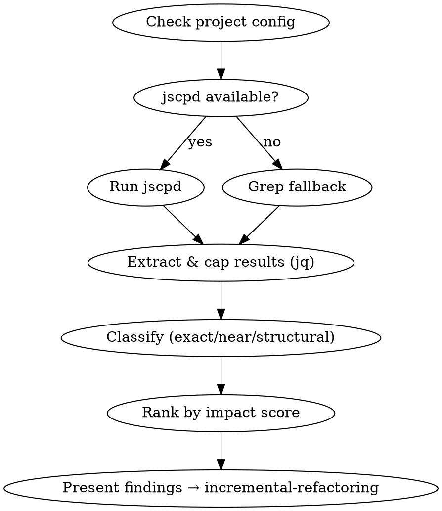

# Duplicate Code Detector

jscpd performs token-level comparison across every file pair, catching duplicates invisible to manual review. This skill runs that analysis and turns output into a classified, prioritized refactoring plan.

**REQUIRED FOLLOW-UP SKILL:** Use `incremental-refactoring` to implement the refactoring after detection.

If the user says "refactor technical debt" or "clean up this codebase", start here to find targets first.



---

## Quick Reference

| Clone Type | Refactoring Pattern |
|---|---|
| **Exact** | Extract Function (no params) |
| **Near** (differs in names/literals) | Parameterize (extract with args) |
| **Structural** (same pattern, different impl) | Template Method / Strategy |

**Ranking:** `impact_score = duplicated_lines x instances`. Tiebreaker: exact > near > structural.

---

## Workflow

### Step 1: Check environment and config

```bash
ls .jscpd.json .jscpdrc .jscpdrc.json 2>/dev/null  # Check project config
which jscpd || npm install -g jscpd                  # Check/install jscpd
```

→ About to run jscpd → Does .jscpd.json (or variant) exist in project root?
  Yes → Run with no overriding flags. Let project config drive thresholds and ignore patterns.
  No → Use defaults (see "Without project config" below).

If jscpd/npm unavailable, use the **Grep Fallback** section below. Tell the user: grep finds exact duplicates only.

### Step 2: Run jscpd

**With project config** (minimal flags, let config drive):
```bash
jscpd --reporters json --output /tmp/jscpd-report --gitignore /path/to/code
```

**Without project config** (sensible defaults):
```bash
jscpd --min-lines 10 --min-tokens 50 \
  --ignore "node_modules,dist,build,vendor,.git,__pycache__,*.min.js,coverage,tmp,generated" \
  --reporters json --output /tmp/jscpd-report --gitignore /path/to/code
```

→ Constructing jscpd command → Verify three required flags present:
  `--gitignore`? `--output /tmp/jscpd-report`? `--reporters json`?
  Any missing → Add before executing.

Tuning: `--min-lines` 5 (small) to 15-20 (large/verbose). `--format "javascript,typescript"` to scope languages.

### Step 3: Extract and cap results

**Token budget management** — use `jq` to avoid loading raw JSON into context:

```bash
# Summary metrics
jq '{percentage: .statistics.total.percentage, duplicatedLines: .statistics.total.duplicatedLines, clones: (.clones | length)}' /tmp/jscpd-report/jscpd-report.json

# All groups above threshold, sorted by impact, fragments capped at 500 chars
# Default: include groups with impact >= 20 (e.g., 10 lines x 2 instances)
# Adjust threshold based on codebase size — lower for small, higher for large
jq '[.clones | group_by(.fragment) | map({fragment: .[0].fragment[0:500], lines: (.[0].duplicationA.end.line - .[0].duplicationA.start.line), instances: length, impact: ((.[0].duplicationA.end.line - .[0].duplicationA.start.line) * length), files: [.[] | .duplicationA.sourceId, .duplicationB.sourceId] | unique}) | sort_by(-.impact) | map(select(.impact >= 20))]' /tmp/jscpd-report/jscpd-report.json
```

**Filtering:** Include all groups above an impact threshold (default: impact >= 20) rather than a hard top-N cap. This surfaces all meaningful duplicates in one pass. Fragments truncated to 500 chars. If the result set is still too large for context, raise the threshold or batch into pages of 10. Present summary metrics first.

**Inline exclusions:** If expected duplicates are missing, check for `jscpd:ignore-start` / `jscpd:ignore-end` markers. Mention these to the user.

### Step 4: Classify and analyze

Dispatch subagents in ONE message, one subagent per duplicate group above the impact threshold, maximum 10 subagents per batch. If >10 groups qualify, batch sequentially in groups of 10 (wait for each batch to complete before dispatching the next).

```
Analyze this duplicate group:
- Source A: <file_a> lines <X-Y>
- Source B: <file_b> lines <M-N>

1. Classify: Exact / Near / Structural (see Quick Reference)
2. Match refactoring pattern to classification
3. Note differences between instances
4. Estimate impact: lines saved, files touched
5. Flag risks: same-looking code with different side effects, or coincidental structural similarity (should NOT be unified)
```

### Step 5: Generate TDD refactoring plan

For each priority item:

```markdown
## Priority 1: [Name] (X lines, Y instances)
**Type:** Exact / Near / Structural
**Pattern:** Extract Function / Parameterize / Template Method
**Impact score:** X | **Files:** list

1. Write test capturing current behavior of one instance
2. Extract shared code with parameters for variation points
3. Replace each instance, run tests after each
4. Remove dead code
```

### Step 6: Present findings

```
## Duplicate Code Analysis
**Metrics:** X% duplication (Y lines, Z clone groups)
**Config:** [project .jscpd.json / defaults] | **Scanned:** [path] (respecting .gitignore)

**Top priorities:**
1. [Name] — Exact, X lines, Y instances (impact: Z) → Extract Function
2. [Name] — Near, X lines, Y instances (impact: Z) → Parameterize

Want to start refactoring Priority 1? (I'll hand off to incremental-refactoring)
```

---

## Grep Fallback (when jscpd unavailable)

**Tell the user upfront:** grep finds exact text duplicates only — no near or structural detection.

Use **ripgrep (`rg`)** if available (respects `.gitignore` by default, handles nested `.gitignore` files). Use `--type` to scope languages (e.g., `--type py --type go`).

**With ripgrep:**
```bash
# Find most-repeated non-trivial lines, with file locations
rg -n --no-heading --type py --type go '.' /path/to/code \
  | awk -F: '{line=$3; for(i=4;i<=NF;i++) line=line":"$i; if(length(line)>60) print line}' \
  | sort | uniq -c | sort -rn | head -20
# Then locate which files contain the top hit:
rg -n --no-heading 'exact duplicate line text here' /path/to/code
```

**Without ripgrep (grep -rn fallback):**
```bash
grep -rn --include='*.py' --include='*.go' \
  --exclude-dir=node_modules --exclude-dir=vendor --exclude-dir=dist --exclude-dir=coverage --exclude-dir=.git \
  '.' /path/to/code \
  | awk -F: '{line=$3; for(i=4;i<=NF;i++) line=line":"$i; if(length(line)>60) print line}' \
  | sort | uniq -c | sort -rn | head -20
```

**Processing results:**
- Cap to **top 20 lines**, investigate top 5-10 as block candidates
- Group adjacent repeated lines into blocks (same file pair = one multi-line block)
- Classify all as **Exact**. Flag "possible Near" if lines differ by 1-2 tokens
- Add to presentation: `**Detection:** grep fallback (exact only) | **Recommendation:** Install jscpd for full detection`

---

## Common Mistakes

| Mistake | Fix |
|---|---|
| Overriding project `.jscpd.json` with flags | Check for config first, use minimal flags if present |
| Loading full jscpd JSON into context | Use `jq` to filter by impact threshold and truncate fragments |
| Skipping `--gitignore` flag | Always pass it — generated/coverage dirs get scanned otherwise |
| Unifying coincidentally similar code | Structural clones with different domains should often stay separate |

## Before finishing

1. jscpd ran (or fallback used) with metrics extracted
2. Project config respected if present
3. `.gitignore` respected via `--gitignore`
4. Results filtered by impact threshold (not hard-capped), fragments truncated to 500 chars
5. Each duplicate classified with matching refactoring pattern
6. Priorities ranked by impact score
7. User told about `jscpd:ignore` markers if relevant
