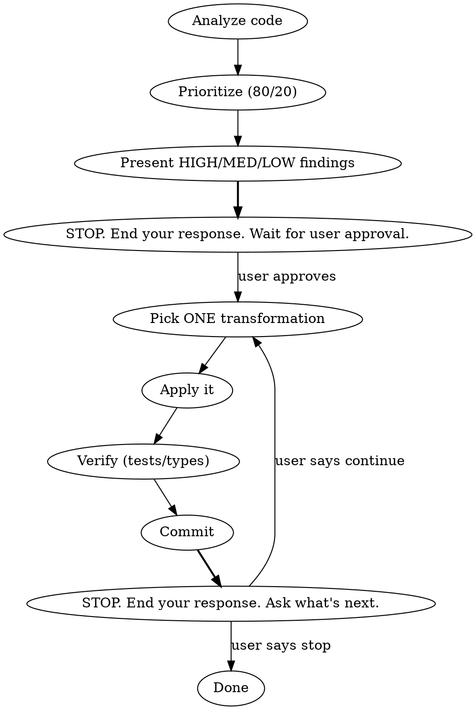

# Incremental Refactoring

**Read [guide.md](guide.md) before starting.** Contains the refactoring catalog, examples, and techniques.

## Two-Phase Workflow

## Phase 1: Analysis ONLY

1. Read [guide.md](guide.md) for smells and catalog
2. Scan for smells (long functions, duplication, deep nesting, unclear names, god classes)
3. **80/20 prioritize** -- few refactorings, highest impact. Stop at diminishing returns
4. Present smells classified as HIGH / MEDIUM / LOW. Do NOT pre-plan execution order

**HARD STOP: End your response after presenting the analysis. Do NOT continue to Phase 2 in the same message. Do NOT show code changes, proposed extractions, or "here's what I would do" previews. The user must explicitly approve before you touch any code.**

## Phase 2: Refactoring (one transformation per cycle)

Only enter Phase 2 after the user has responded with approval.

5. Pick ONE transformation from guide.md catalog
6. Apply it
7. Verify: run tests, check types, or explain why before/after are equivalent
8. Commit (single transformation per commit)

**HARD STOP: End your response after each transformation. Ask the user if they want to continue, adjust direction, or stop. Do NOT batch multiple transformations in one response.**

9. Decide next step from observation of current state, not from an upfront plan
10. Stop when high-impact items are done -- perfect code is not the goal

## Quick Reference

See [guide.md](guide.md) for the full smell → transformation catalog with examples.

**Push back on refactoring** when code is stable, tested, rarely touched, or has unclear requirements. "Ugly" alone is not sufficient reason.

## Red Flags -- STOP If You Think Any of These

| Thought | Correct Response |
|---------|-----------------|
| "I'll extract all 6 methods at once" | ONE transformation, verify, commit, then next |
| "I'll refactor while adding this feature" | Separate. Refactor first OR feature first. Never both |
| "This is ugly, I should clean it up" | Does it change often? Causing bugs? If no, push back |
| "Let me plan all steps upfront" | Plan only the next step. Observe after each |
| "I'll show what I would do so they can approve" | That IS doing it. Present analysis, STOP, wait |
| "I'll present all cycles for review" | One cycle per response. User controls the pace |
| "Tests are slow, I'll batch verifications" | Verify after EVERY transformation |
| "I'll just do a quick rename too" | Second transformation. Commit the first one first |
| "User said refactor so I should refactor everything" | 80/20. Stop at diminishing returns |
